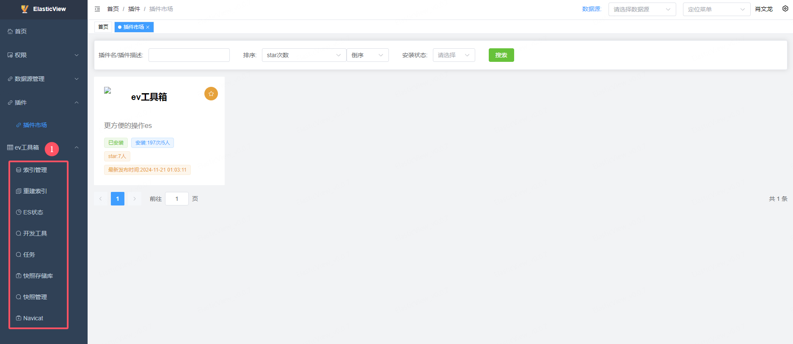

# ElasticView

ElasticView 是一个多数据源集成管理平台

- [官网链接](http://www.elastic-view.cn/index.html)

**下载镜像**

```
docker pull 1340691923/elastic_view:v0.0.7
```

**推送到仓库**

```
docker tag 1340691923/elastic_view:v0.0.7 registry.lingo.local/service/elastic_view:v0.0.7
docker push registry.lingo.local/service/elastic_view:v0.0.7
```

**保存镜像**

```
docker save registry.lingo.local/service/elastic_view:v0.0.7 | gzip -c > image-elastic_view_v0.0.7.tar.gz
```

**创建目录**

```
sudo mkdir -p /data/container/elastic-view/{data,config,plugins}
```

**创建配置文件**

注意修改 `rootUrl` 配置，需要和最后浏览器访问的URL保证一致

```
sudo tee /data/container/elastic-view/config/config.yml <<"EOF"
log:
  storageDays: 4          # 日志保留天数
  logDir: "logs"          # 日志保留文件夹
port: 8090                # 启动端口
pluginRpcPort: 8091       # 插件内网访问端口
rootUrl: http://192.168.1.12:20011/  # 项目访问根目录
dbType: "sqlite3"         # 数据保留类型 分为 sqlite3 和 mysql
enableLogEs: false        # 是否记录 es 请求记录
enableLogEsRes: false     # 是否记录 es 请求记录中返回的响应体
sqlite:                   # dbType 为 sqlite3 时填 dbPath 为数据保存文件地址
  dbName: "es_view.db"
mysql:                    # dbType 为 mysql 时填
  username: "root"
  pwd: ""
  ip: "localhost"
  port: "3306"
  dbName: "test"
  maxOpenConns: 10
  maxIdleConns: 10
esPwdSecret: "concat_mail!!->1340691923@qq.com" # es 密码加密密钥
version: "0.0.7"          # EV 版本号
deBug: false              # 是否为测试模式
checkForevUpdates: true   # 是否自动检测 ev 更新
checkForPluginUpdates: true  # 是否自动检测 ev 插件更新
evKey:                    # evKey 需要到插件者后台注册获取
storeFileDir: store_file_dir # 临时文件存放目录
plugin:
  loadPath: plugins       # 插件存放目录
  storePath: plugins_store # 插件临时文件存放目录
watermarkContent: ElasticView # 水印
translation:
  lang: zh-cn             # zh-cn 或 en
  cfgDir: config/ev-i18n  # i18n 文件存放目录
oauth:
  workwechat:
    agentid: ""
    corpid: ""
    enable: false
    secert: ""
EOF
```

**创建服务**

```
docker run -d --name ateng-elastic-view \
  -p 20011:8090 --restart=always \
  -v /data/container/elastic-view/config/config.yml:/app/config/config.yml:ro \
  -v /data/container/elastic-view/data:/app/data \
  -v /data/container/elastic-view/plugins:/app/plugins \
  -e TZ=Asia/Shanghai \
  registry.lingo.local/service/elastic_view:v0.0.7
```

**查看服务**

```
docker logs -f ateng-elastic-view
```

**访问服务**

```
URL: http://192.168.1.12:20011/
Username: admin
Password: admin
```

**连接服务**

可以连接`OpenSearch` 或者 `ElasticSearch`


测试ping


**安装插件**

安装**ev工具箱**，ev工具箱是用于管理es集群的ElasticView插件


安装完后刷新页面




**使用ev工具箱**


**删除服务**

停止服务

```
docker stop ateng-elastic-view
```

删除服务

```
docker rm ateng-elastic-view
```

删除目录

```
sudo rm -rf /data/container/elastic-view
```

