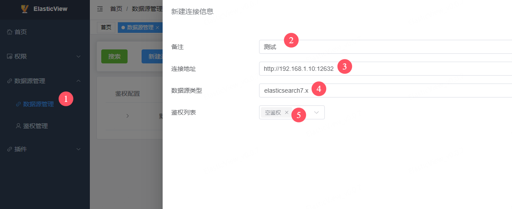
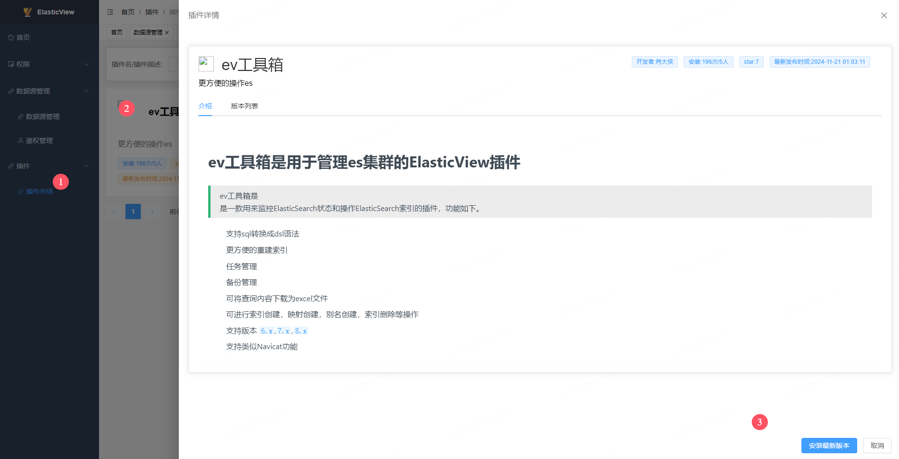
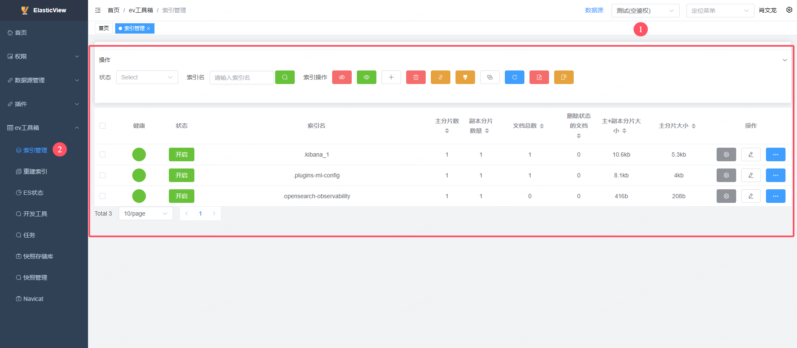

# ElasticView

ElasticView 是一个多数据源集成管理平台

- [官网链接](http://www.elastic-view.cn/index.html)

**下载镜像**

```
docker pull 1340691923/elastic_view:v0.0.7
```

**推送到仓库**

```
docker tag 1340691923/elastic_view:v0.0.7 registry.lingo.local/service/elastic_view:v0.0.7
docker push registry.lingo.local/service/elastic_view:v0.0.7
```

**保存镜像**

```
docker save registry.lingo.local/service/elastic_view:v0.0.7 | gzip -c > image-elastic_view_v0.0.7.tar.gz
```

**修改配置**

修改 `deploy.yaml`

- ConfigMap中的**rootUrl**需要和最终访问的URL一致
- Deployment中的镜像地址和存储类

**创建服务**

```
kubectl apply -n kongyu -f deploy.yaml
```

**查看服务**

```
kubectl get -n kongyu pod,svc,pvc -l app=elastic-view
kubectl logs -n kongyu -f elastic-view-0
```

**访问服务**

```
URL: http://192.168.1.10:38090/
Username: admin
Password: admin
```

**连接服务**

可以连接`OpenSearch` 或者 `ElasticSearch`



测试ping


**安装插件**

安装**ev工具箱**，ev工具箱是用于管理es集群的ElasticView插件



安装完后刷新页面


**使用ev工具箱**




**删除服务**

```
kubectl delete -n kongyu -f deploy.yaml
kubectl delete -n kongyu pvc -l app=elastic-view
```

