# KVM

KVM（Kernel-based Virtual Machine）是Linux内核的一部分，让你的Linux系统变成一个虚拟化的主机。它使用CPU的虚拟化扩展（比如Intel VT-x和AMD-V）来创建和管理虚拟机（VM）。KVM支持多种操作系统，包括Linux和Windows，且可以通过QEMU进行硬件仿真。

## 安装 QEMU

**确保以root用户身份操作，以避免权限问题。**

### 基础配置

在安装之前，先检查一下系统设置：

1. **检查硬件虚拟化支持**：

    ```bash
    egrep '(vmx|svm)' /proc/cpuinfo
    ```

    *这个命令会告诉你CPU是否支持虚拟化。有输出说明支持，如果没有，得去BIOS里开一下。*

2. **关闭防火墙**：

    ```bash
    systemctl stop firewalld
    systemctl disable firewalld
    ```

    *为了避免防火墙阻止虚拟机的网络连接，这里先把它关闭。*

3. **禁用 Selinux**：

    ```bash
    sed -i 's/SELINUX=.*/SELINUX=disabled/' /etc/selinux/config
    setenforce 0
    ```

    *Selinux有时会限制虚拟化的操作，所以我们暂时禁用它。*

### OpenEuler 24

1. **安装 KVM 软件**：

    ```bash
    dnf -y install qemu libvirt virt-install bridge-utils libguestfs-tools virt-manager guestfs-tools
    ```

    *运行这个命令来安装KVM及其管理工具，准备创建虚拟机。*

2. **启动 libvirtd 服务**：

    ```bash
    systemctl start libvirtd
    systemctl enable libvirtd
    ```

    *libvirtd是管理虚拟机的服务，必须启动才能正常工作。*

### CentOS 7

1. **安装 KVM 软件**：

    ```bash
    rm -rf /etc/yum.repos.d/*
    curl -o /etc/yum.repos.d/Centos-7.repo http://mirrors.aliyun.com/repo/Centos-7.repo
    curl -o /etc/yum.repos.d/epel-7.repo http://mirrors.aliyun.com/repo/epel-7.repo
    
    cat > /etc/yum.repos.d/kvm.repo <<EOF
    [kvm]
    name=kvm
    baseurl=https://mirrors.aliyun.com/centos/7/virt/x86_64/kvm-common/
    gpgcheck=0
    enabled=1
    
    [virt]
    name=virt
    baseurl=http://mirrors.aliyun.com/centos/7/virt/x86_64/libvirt-latest/
    gpgcheck=0
    enabled=1
    EOF
    
    yum -y install qemu-kvm-ev-2.12.0 libvirt virt-install bridge-utils virt-manager python36-libvirt libguestfs-tools
    ```

    *清理旧的仓库配置，添加新的软件源，然后安装KVM及相关工具。*

2. **启动 libvirtd 服务**：

    ```bash
    systemctl start libvirtd
    systemctl enable libvirtd
    ```

    *同样，启动服务以管理虚拟机。*

## 配置虚拟网络

设置虚拟网络，使虚拟机能够联网。

### OpenEuler 24

#### 桥接网络

1. **创建桥接网络 `br0`**：

    ```bash
    nmcli connection add type bridge ifname br0 con-name br0
    nmcli connection modify br0 ipv4.addresses 192.168.1.113/24
    nmcli connection modify br0 ipv4.gateway 192.168.1.1
    nmcli connection modify br0 ipv4.dns 192.168.1.12
    nmcli connection modify br0 ipv4.method manual
    ```

    *这里创建一个名为`br0`的桥接网络，并配置IP、网关和DNS。*

2. **配置物理网卡（假设为 `ens33`）为桥接模式**：

    *将物理网卡配置为桥接模式，确保它能与桥接网络连接。*

    ```bash
    nmcli connection add type bridge-slave ifname ens33 master br0 con-name ens33-slave
    ```

3. **启动桥接和物理网卡**：

    设置为自动连接

    ```
    nmcli connection modify br0 autoconnect yes
    nmcli connection modify ens33-slave autoconnect yes
    ```

    启动刚刚配置的桥接网络和物理网卡，注意网络会断掉一小会，网卡在切换IP

    ```bash
    nmcli connection up br0
    nmcli connection up ens33-slave
    ```

4. **查看桥接网络状态**：

    ```bash
    [root@localhost ~]# ip a show br0
    12: br0: <BROADCAST,MULTICAST,UP,LOWER_UP> mtu 1500 qdisc noqueue state UP group default qlen 1000
        link/ether 00:0c:29:87:5e:8c brd ff:ff:ff:ff:ff:ff
        inet 192.168.1.113/24 brd 192.168.1.255 scope global noprefixroute br0
           valid_lft forever preferred_lft forever
        inet6 fe80::13f8:f5b:f490:b3be/64 scope link noprefixroute
           valid_lft forever preferred_lft forever
    [root@localhost ~]# brctl show
    bridge name     bridge id               STP enabled     interfaces
    br0             8000.000c29875e8c       yes             ens33
    virbr0          8000.525400ae3a64       yes
    ```

    *检查网络状态，确认桥接是否成功。*

5. **创建虚拟机时指定桥接网络**：

    ```bash
    --network bridge=br0,model=virtio
    ```

    *在创建虚拟机时，使用这个参数来指定桥接网络。*

#### NAT网络

1. **启用路由转发功能**：

    ```bash
    echo "net.ipv4.ip_forward = 1" | sudo tee -a /etc/sysctl.conf
    sysctl -p
    ```

    *开启路由转发功能，以允许虚拟机通过主机上网。*

2. **创建虚拟机时指定 NAT 网络**：

    ```bash
    --network network=default,model=virtio
    ```

    *在创建虚拟机时，使用这个参数来指定NAT网络。*

### CentOS 7

#### 桥接网络

1. **创建 `br0` 网络文件**：

    ```bash
    cat > /etc/sysconfig/network-scripts/ifcfg-br0 <<EOF
    TYPE="Bridge"
    BOOTPROTO="static"
    DEVICE="br0"
    ONBOOT="yes"
    IPADDR="192.168.1.201"
    PREFIX="24"
    GATEWAY="192.168.1.1"
    DNS1="192.168.1.1"
    EOF
    ```

    *创建一个桥接网络配置文件，使虚拟机可以通过桥接方式联网。*

2. **物理网卡指定桥接网卡**：

    ```bash
    echo "BRIDGE=br0" >> /etc/sysconfig/network-scripts/ifcfg-ens32
    ```

    *将物理网卡配置为使用桥接网卡。*

3. **重启网络**：

    ```bash
    systemctl restart network
    ip a
    ```

    *重启网络服务并查看桥接状态。*

4. **创建虚拟机时指定桥接网络**：

    ```bash
    --network bridge=br0,model=virtio
    ```

    *在创建虚拟机时，使用这个参数来指定桥接网络。*

#### NAT网络

1. **开启路由转发功能**：

    ```bash
    echo "net.ipv4.ip_forward = 1" > /etc/sysctl.conf
    sysctl -p
    ```

    *开启IPv4路由转发。*

2. **创建虚拟机时指定 NAT 网络**：

    ```bash
    --network network=default,model=virtio
    ```

    *在创建虚拟机时，使用这个参数来指定NAT网络。*

## 制作官方镜像

### CentOS 7 镜像

https://www.xiexianbin.cn/openstack/images/2015-06-07-build-openstack-glance-image/index.html?to_index=1

1. **下载镜像**：

    ```bash
    mkdir -p /kvm
    chown qemu:qemu /kvm
    cd /kvm
    curl -L -O http://cloud.centos.org/centos/7/images/CentOS-7-x86_64-GenericCloud.qcow2c
    cp CentOS-7-x86_64-GenericCloud.qcow2c{,_bak}
    ```

    *创建一个目录来存放镜像并下载CentOS 7镜像。*

2. **设置镜像 root 用户密码并开启 SSH**：

    前面一步下载的 Image 中 root 用户默认密码被锁定，后续步骤中我们需要以 root 用户登录到系统中对系统进行定制，因此需要设置 root 用户密码

    ```bash
    virt-sysprep --root-password password:Admin@123 -a CentOS-7-x86_64-GenericCloud.qcow2c
    ```

    *设置root密码，以便后续操作。*

    ```bash
    cat > commands-from.file <<EOF
    password root:password:Admin@123
    edit /etc/ssh/sshd_config:\
        s/^PasswordAuthentication.*/PasswordAuthentication yes/
    edit /etc/ssh/sshd_config:\
        s/^PermitRootLogin.*/PermitRootLogin yes/
    EOF
    virt-customize -a CentOS-7-x86_64-GenericCloud.qcow2c --commands-from-file commands-from.file --run-command "echo hello"
    ```

    *配置SSH以允许root用户登录。*

3. **启动虚拟机**：

    ```bash
    virt-install --connect qemu:///system --import \
        --name centos-1 --ram 2048 --vcpus 2 \
        --network network=default,model=virtio \
        --disk path=./CentOS-7-x86_64-GenericCloud.qcow2c,format=qcow2,device=disk,bus=virtio \
        --graphics vnc,listen=0.0.0.0,password=12345678,port=5921 \
        --noautoconsole --autostart --accelerate \
        --os-type=linux --os-variant=centos7.0
    ```

    *启动虚拟机并使用之前下载的镜像。*


4. **定制系统**：

    1）**连接虚拟机**：

    通过SSH方式连接前面启动的虚拟机，以 root 用户身份登录到系统中，对系统进行定制（如安装自定义软件包，修改配置等）。定制完成后关闭虚拟机。
    这里只根据通信缓存记录的mac 、IP地址手段做排查。在没缓存的情况下，下面的方法不适用，建议使用VNC连接然后查看IP地址，再进行SSH连接

    通过SSH连接前面启动的虚拟机，使用root用户登录进行定制。

    ```bash
    MAC=$(virsh dumpxml centos-1 | grep -o "<mac address=.*/>" | awk -F "'" '{print $2}')
    IPADDR=$(arp -ne | grep ${MAC} | awk '{print $1}')
    echo ${IPADDR}
    ssh root@${IPADDR}
    ```

    *获取虚拟机的MAC地址，查找IP并SSH连接。*

    2）**配置 cloud.cfg**：

    ```bash
    mv /etc/cloud/cloud.cfg /etc/cloud/cloud.cfg-$(date +%Y%m%d%H%M%S)
    curl -L -o /etc/cloud/cloud.cfg https://github.com/kongyu666/data/releases/download/service/cloud.cfg
    cloud-init init --local
    ```

    *备份并下载新的cloud配置文件，以便在云环境中使用。*

    3）**设置主机名**：

    ```bash
    hostnamectl set-hostname centos.ateng.local
    ```

    *更改主机名。*

    4）**配置SSH**：

    配置免秘钥

    ```
    ssh-keygen -t rsa -P "" -f ~/.ssh/id_rsa -C "2385569970@qq.com"
    cat ~/.ssh/id_rsa.pub > ~/.ssh/authorized_keys
    ```

    *配置SSH以允许密码登录并重启服务。*

    ```bash
    sed -i \
        -e "s/PasswordAuthentication.*/PasswordAuthentication yes/g" \
        -e 's/#UseDNS yes/UseDNS no/g' \
        -e 's/GSSAPIAuthentication yes/GSSAPIAuthentication no/g' \
        -e 's/#PermitRootLogin prohibit-password/PermitRootLogin yes/g' \
        /etc/ssh/sshd_config
    sed -i 's/#   StrictHostKeyChecking ask/   StrictHostKeyChecking no/g' /etc/ssh/ssh_config
    systemctl restart sshd
    ```

    5）**更新YUM源**：

    ```bash
    rm -rf /etc/yum.repos.d/*
    curl -o /etc/yum.repos.d/Centos-7.repo http://mirrors.aliyun.com/repo/Centos-7.repo
    curl -o /etc/yum.repos.d/epel-7.repo http://mirrors.aliyun.com/repo/epel-7.repo
    ```

    *更新软件源，以确保软件包是最新的。*

    6）**更改时区和时间**：

    ```bash
    timedatectl set-timezone Asia/Shanghai
    clock -w
    timedatectl set-local-rtc 1
    sed -i "/^server/d" /etc/chrony.conf
    sed -i "3i server ntp.aliyun.com iburst" /etc/chrony.conf
    systemctl restart chronyd
    chronyc sources
    ```

    *设置时区为上海，并同步时间。*

    7）**禁用 SELinux**：

    ```bash
    sed -i "s/SELINUX=.*/SELINUX=disabled/g" /etc/selinux/config
    setenforce 0
    ```

    *禁用SELinux以避免限制操作。*

    8）**关闭虚拟机**：

    ```bash
    poweroff
    ```

    *完成定制后关闭虚拟机。*

5. **工具自动清除虚拟机信息**：

    使用 `virt-sysprep` 命令清除镜像中的唯一性信息（如SSH密钥、网卡MAC地址等）。

    ```bash
    virt-sysprep -d centos-1
    ```

    *运行此命令以准备干净的镜像。*

6. **镜像大小优化**：

    1）**消除镜像空洞**：

    ```bash
    mkdir -p /data/tmp
    virt-sparsify --tmp /data/tmp ./CentOS-7-x86_64-GenericCloud.qcow2c ./centos-7.9-2009-x86_64-02
    ```

    *通过消除空洞来减小镜像大小。*

    2）**二次压缩镜像**：

    ```bash
    qemu-img convert -c -f qcow2 -O qcow2 -p ./centos-7.9-2009-x86_64-02 ./centos-7.9-2009-x86_64-02.qcow2
    ```

    *进一步压缩镜像以节省空间。*

7. **删除虚拟机**：

    ```bash
    virsh shutdown centos-1
    virsh destroy centos-1
    virsh undefine centos-1
    ```

    *如果不再需要虚拟机，可以使用这些命令删除它。*

### OpenEuler 24 镜像

http://www.openeuler.org/zh/download/

https://docs.openeuler.org/zh/docs/24.03_LTS/docs/Releasenotes/%E7%B3%BB%E7%BB%9F%E5%AE%89%E8%A3%85.html

1. **下载镜像**：

    ```bash
    mkdir -p /kvm
    chown qemu:qemu /kvm
    cd /kvm
    curl -L -O https://mirrors.jxust.edu.cn/openeuler/openEuler-24.03-LTS/virtual_machine_img/x86_64/openEuler-24.03-LTS-x86_64.qcow2.xz
    unxz openEuler-24.03-LTS-x86_64.qcow2.xz
    cp openEuler-24.03-LTS-x86_64.qcow2{,_bak}
    ```

    *从官方网站下载OpenEuler镜像以供使用。*

2. **启动虚拟机**：

    ```bash
    virt-install --connect qemu:///system --import \
        --name openEuler-1 --ram 2048 --vcpus 2 \
        --network network=default,model=virtio \
        --disk path=./openEuler-24.03-LTS-x86_64.qcow2,format=qcow2,device=disk,bus=virtio \
        --graphics vnc,listen=0.0.0.0,password=12345678,port=5921 \
        --noautoconsole --autostart --accelerate \
        --os-type=linux --os-variant=linux2022
    ```

    *启动虚拟机并使用之前下载的镜像。*


4. **定制系统**：

    1）**连接虚拟机**：

    通过SSH方式连接前面启动的虚拟机，以 root 用户身份登录到系统中，对系统进行定制（如安装自定义软件包，修改配置等）。定制完成后关闭虚拟机。
    这里只根据通信缓存记录的mac 、IP地址手段做排查。在没缓存的情况下，下面的方法不适用，建议使用VNC连接然后查看IP地址，再进行SSH连接

    通过SSH连接前面启动的虚拟机，使用root用户登录进行定制。

    ```bash
    MAC=$(virsh dumpxml openEuler-1 | grep -o "<mac address=.*/>" | awk -F "'" '{print $2}')
    IPADDR=$(arp -ne | grep ${MAC} | awk '{print $1}')
    echo ${IPADDR}
    ssh root@${IPADDR}
    ```

    **说明：** 虚拟机镜像root用户默认密码为：openEuler12#$，首次登录后请及时修改。

    *获取虚拟机的MAC地址，查找IP并SSH连接。*

    2）**修改root密码和配置免秘钥**：

    ```bash
    echo Admin@123 | passwd root --stdin
    ssh-keygen -t rsa -P "" -f ~/.ssh/id_rsa -C "2385569970@qq.com"
    cat ~/.ssh/id_rsa.pub > ~/.ssh/authorized_keys
    ```

    3）**设置主机名**：

    ```bash
    hostnamectl set-hostname openeuler.ateng.local
    ```

    *更改主机名。*

    4）**设置hosts文件**：

    ```bash
    cat > /etc/hosts <<EOF
    127.0.0.1   localhost localhost.localdomain localhost4 localhost4.localdomain4
    ::1         localhost localhost.localdomain localhost6 localhost6.localdomain6
    127.0.0.1 openeuler.ateng.local
    EOF
    ```

    *更改主机名。*

    6）**更改时区和时间**：

    ```bash
    timedatectl set-timezone Asia/Shanghai
    clock -w
    timedatectl set-local-rtc 1
    dnf -y install chrony
    dnf clean all
    sed -i "/^pool/d" /etc/chrony.conf
    sed -i "3i pool ntp.aliyun.com iburst" /etc/chrony.conf
    systemctl restart chronyd
    chronyc sources
    ```

    *设置时区为上海，并同步时间。*

    8）**关闭虚拟机**：

    ```bash
    poweroff
    ```

    *完成定制后关闭虚拟机。*

5. **工具自动清除虚拟机信息**：

    使用 `virt-sysprep` 命令清除镜像中的唯一性信息（如SSH密钥、网卡MAC地址等）。

    ```bash
    virt-sysprep -d openEuler-1
    ```

    *运行此命令以准备干净的镜像。*

6. **镜像大小优化**：

    1）**消除镜像空洞**：

    ```bash
    mkdir -p /data/tmp
    virt-sparsify --tmp /data/tmp ./openEuler-24.03-LTS-x86_64.qcow2 ./openeuler-24.03-x86_64-02
    ```

    *通过消除空洞来减小镜像大小。*

    2）**二次压缩镜像**：

    ```bash
    qemu-img convert -c -f qcow2 -O qcow2 -p ./openeuler-24.03-x86_64-02 ./openeuler-24.03-x86_64-02.qcow2
    ```

    *进一步压缩镜像以节省空间。*

7. **删除虚拟机**：

    ```bash
    virsh shutdown openEuler-1
    virsh destroy openEuler-1
    virsh undefine openEuler-1
    ```

    *如果不再需要虚拟机，可以使用这些命令删除它。*

### Windows Server 2012

https://cloudbase.it/windows-cloud-images

下载镜像地址：https://cloudbase.it/euladownload.php?h=kvm


## 制作自定义镜像

### CentOS 7 镜像

#### 启动vm

**下载ISO镜像和创建qcow2镜像**：

```bash
mkdir -p /kvm
chown qemu:qemu /kvm
cd /kvm
curl -L -O https://mirrors.aliyun.com/centos/7/isos/x86_64/CentOS-7-x86_64-DVD-2009.iso
qemu-img create -f qcow2 centos.qcow2 5G
```

**启动虚拟机**：

```bash
virt-install --connect qemu:///system \
    --name centos --ram 2048 --vcpus 2 \
    --network network=default \
    --disk path=./centos.qcow2,format=qcow2 \
    --location=./CentOS-7-x86_64-DVD-2009.iso \
    --graphics vnc,listen=0.0.0.0,password=12345678,port=5902 \
    --noautoconsole --autostart \
    --os-type=linux --os-variant=centos7.0
```

*启动虚拟机并使用之前下载的镜像。*

#### **安装操作系统**

选择语言 **English**，不要选择中文，会出现字符问题需要解决。

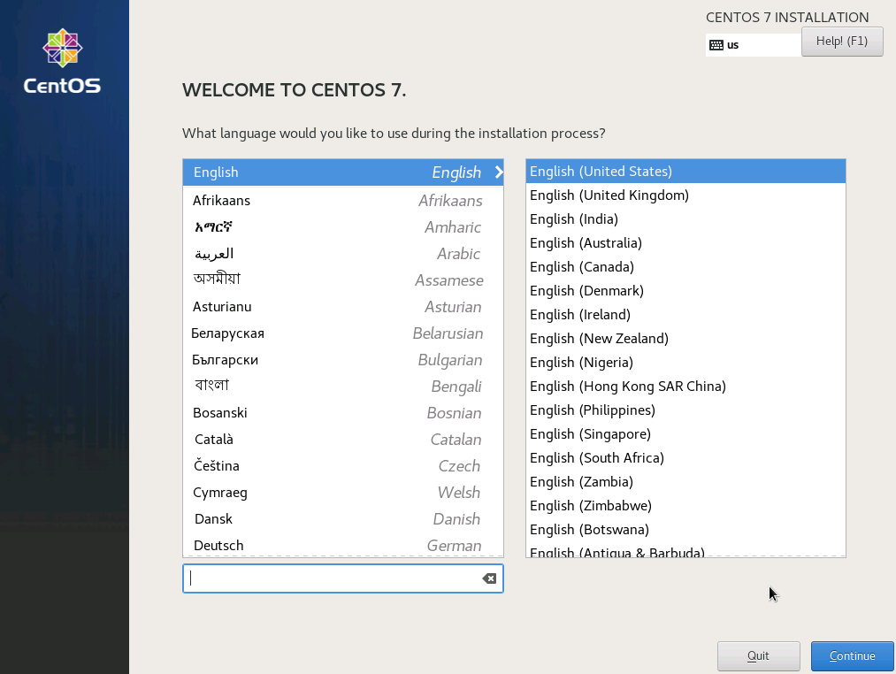

开启网络，使用DHCP

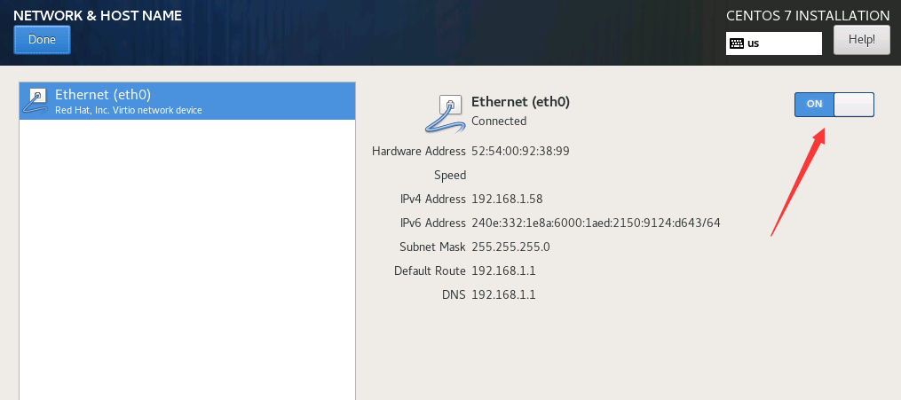

创建Standard Partition模式分区，如下图所示

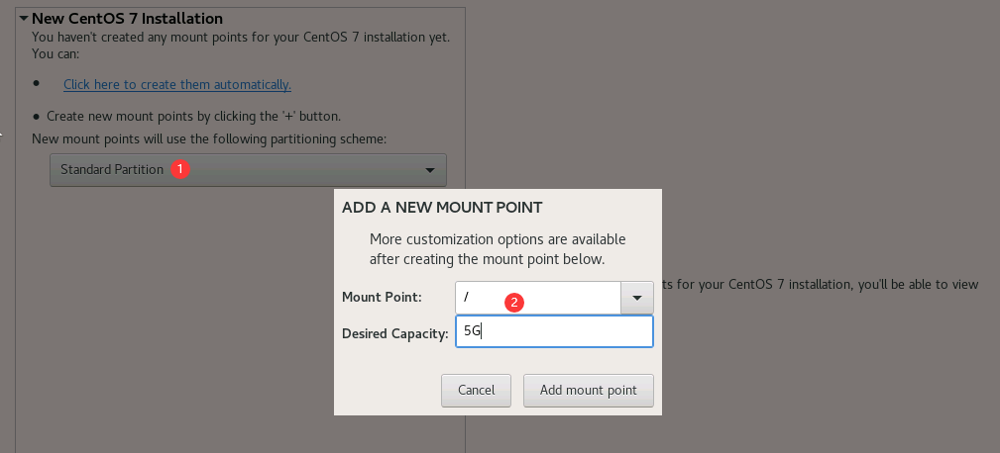

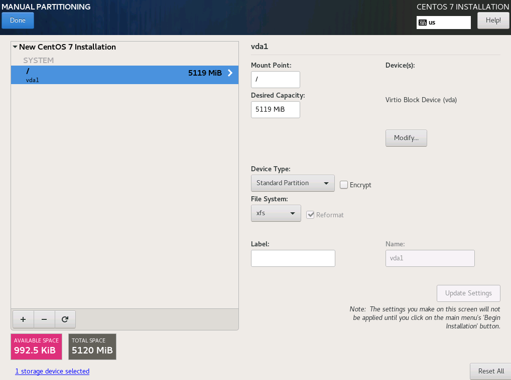

安装完毕后系统会重启，然后需要手动开机：`virsh start centos`，再次使用VNC连接进行相应的配置

#### **连接虚拟机**

通过SSH方式连接前面启动的虚拟机，以 root 用户身份登录到系统中，对系统进行定制（如安装自定义软件包，修改配置等）。定制完成后关闭虚拟机。
这里只根据通信缓存记录的mac 、IP地址手段做排查。在没缓存的情况下，下面的方法不适用，建议使用VNC连接然后查看IP地址，再进行SSH连接

通过SSH连接前面启动的虚拟机，使用root用户登录进行定制。

```bash
MAC=$(virsh dumpxml centos | grep -o "<mac address=.*/>" | awk -F "'" '{print $2}')
IPADDR=$(arp -ne | grep ${MAC} | awk '{print $1}')
echo ${IPADDR}
ssh root@${IPADDR}
```

*获取虚拟机的MAC地址，查找IP并SSH连接。*

#### **安装软件包**

**配置yum源**

```
rm -rf /etc/yum.repos.d/*
curl -o /etc/yum.repos.d/Centos-7.repo \
    http://mirrors.aliyun.com/repo/Centos-7.repo
curl -o /etc/yum.repos.d/epel-7.repo \
    http://mirrors.aliyun.com/repo/epel-7.repo
```

**安装ACPI服务**

```
yum -y install acpid
systemctl enable acpid
```

**安装cloud-init**

```
yum -y install cloud-init
```

**安装cloud-utils-growpart允许分区调整**

```
yum -y install cloud-utils-growpart
```

**配置控制台**

如果希望在仪表盘界面查看nova控制台的日志，需要做以下配置：

```
sed -i 's#GRUB_CMDLINE_LINUX=.*#GRUB_CMDLINE_LINUX="crashkernel=auto console=tty0 console=ttyS0,115200n8 net.ifnames=0"#g' /etc/default/grub
grub2-mkconfig -o /boot/grub2/grub.cfg
```

#### 优化操作系统

**修改root密码**：

```bash
echo Admin@123 | passwd root --stdin
```

**设置主机名**：

```bash
hostnamectl set-hostname centos.ateng.local
```

**设置hosts文件**：

```bash
cat > /etc/hosts <<EOF
127.0.0.1   localhost localhost.localdomain localhost4 localhost4.localdomain4
::1         localhost localhost.localdomain localhost6 localhost6.localdomain6
127.0.0.1 centos.ateng.local
EOF
```

**配置SSH**：

配置免秘钥

```
ssh-keygen -t rsa -P "" -f ~/.ssh/id_rsa -C "2385569970@qq.com"
cat ~/.ssh/id_rsa.pub > ~/.ssh/authorized_keys
```

*配置SSH以允许密码登录并重启服务。*

```bash
sed -i \
    -e "s/PasswordAuthentication.*/PasswordAuthentication yes/g" \
    -e 's/#UseDNS yes/UseDNS no/g' \
    -e 's/GSSAPIAuthentication yes/GSSAPIAuthentication no/g' \
    -e 's/#PermitRootLogin prohibit-password/PermitRootLogin yes/g' \
    /etc/ssh/sshd_config
sed -i 's/#   StrictHostKeyChecking ask/   StrictHostKeyChecking no/g' /etc/ssh/ssh_config
```

**更改时区和时间**：

```bash
timedatectl set-timezone Asia/Shanghai
clock -w
timedatectl set-local-rtc 1
sed -i "/^server/d" /etc/chrony.conf
sed -i "3i server ntp.aliyun.com iburst" /etc/chrony.conf
systemctl restart chronyd
chronyc sources
```

*设置时区为上海，并同步时间。*

**禁用 SELinux 和 关闭防火墙**：

```bash
sed -i "s/SELINUX=.*/SELINUX=disabled/g" /etc/selinux/config
setenforce 0
systemctl stop firewalld
systemctl disable firewalld
```

*禁用SELinux以避免限制操作。*

**优化 cloud-init**

更新配置文件

```
cat > /etc/cloud/cloud.cfg <<"EOF"
## Author: KongYu
## Mail: 2385569970@qq.com
## Data: 2022-05-11
## Description:
## https://cloudinit.readthedocs.io/en/latest/topics/examples.html
## https://cloudinit.readthedocs.io/en/latest/topics/modules.html?highlight=disable_root
## https://cloudinit.readthedocs.io/en/latest/topics/network-config-format-v1.html

## 向系统添加组
groups:
  - ateng

## 向系统添加用户，添加组后再添加用户
users:
  - name: kongyu
    expiredate: 2099-12-31
    groups: ateng
    sudo: ALL=(ALL) NOPASSWD:ALL
    homedir: /home/kongyu
    lock_passwd: false

## 不禁用root登录
disable_root: false

## 开启ssh密码验证功能
ssh_pwauth: true
## 设置需要修改的默认密码
chpasswd:
  expire: false
  list:
    - kongyu:Admin@123

## 要设置的完全限定域名
fqdn: ateng.local
## 要设置的主机名
hostname: centos.ateng.local
## 如果设置了fqdn，则使用fqdn。如果为false，则使用主机名
prefer_fqdn_over_hostname: true
## 当hostname为true时不更新系统主机名。如果为true，则主机名不会更改
preserve_hostname: true
## 是否管理系统的/etc/hosts
manage_etc_hosts: false

## 自动配置网卡文件
network:
  version: 1
  config:
  - type: physical
    name: eth0
    subnets:
      - type: dhcp

mount_default_fields: [~, ~, 'auto', 'defaults,nofail,x-systemd.requires=cloud-init.service', '0', '2']
resize_rootfs_tmp: /dev
ssh_deletekeys:   1
ssh_genkeytypes:  ~
syslog_fix_perms: ~
disable_vmware_customization: false

cloud_init_modules:
 - disk_setup
 - migrator
 - bootcmd
 - write-files
 - growpart
 - resizefs
# - set_hostname
# - update_hostname
# - update_etc_hosts
 - rsyslog
 - users-groups
 - ssh

cloud_config_modules:
 - mounts
 - locale
 - set-passwords
 - rh_subscription
 - yum-add-repo
 - package-update-upgrade-install
 - timezone
 - puppet
 - chef
 - salt-minion
 - mcollective
 - disable-ec2-metadata
 - runcmd

cloud_final_modules:
 - rightscale_userdata
 - scripts-per-once
 - scripts-per-boot
 - scripts-per-instance
 - scripts-user
 - ssh-authkey-fingerprints
 - keys-to-console
 - phone-home
 - final-message
 - power-state-change

system_info:
  default_user:
    name: centos
    lock_passwd: true
    gecos: Cloud User
    groups: [adm, systemd-journal]
    sudo: ["ALL=(ALL) NOPASSWD:ALL"]
    shell: /bin/bash
  distro: rhel
  paths:
    cloud_dir: /var/lib/cloud
    templates_dir: /etc/cloud/templates
  ssh_svcname: sshd

# vim:syntax=yaml
EOF
```

初始化配置

```
cloud-init init --local
```

**关闭虚拟机**：

```bash
poweroff
```

*完成定制后关闭虚拟机。*

#### 优化镜像

**工具自动清除虚拟机信息**：

使用 `virt-sysprep` 命令清除镜像中的唯一性信息（如SSH密钥、网卡MAC地址等）。

```bash
virt-sysprep -d centos
```

*运行此命令以准备干净的镜像。*

**镜像大小优化**：

**消除镜像空洞**：

```bash
mkdir -p /data/tmp
virt-sparsify --tmp /data/tmp ./centos.qcow2 ./centos-7.9-2009-x86_64-01
```

*通过消除空洞来减小镜像大小。*

**二次压缩镜像**：

```bash
qemu-img convert -c -f qcow2 -O qcow2 -p ./centos-7.9-2009-x86_64-01 ./centos-7.9-2009-x86_64-01.qcow2
```

*进一步压缩镜像以节省空间。*

#### **删除虚拟机**

```bash
virsh shutdown centos
virsh destroy centos
virsh undefine centos
```

*如果不再需要虚拟机，可以使用这些命令删除它。*

### OpenEuler 24 镜像

#### 启动vm

**下载ISO镜像和创建qcow2镜像**：

```bash
mkdir -p /kvm
chown qemu:qemu /kvm
cd /kvm
curl -L -O https://mirrors.pku.edu.cn/openeuler/openEuler-24.03-LTS/ISO/x86_64/openEuler-24.03-LTS-x86_64-dvd.iso
qemu-img create -f qcow2 openEuler.qcow2 10G
```

**启动虚拟机**：

```bash
virt-install --connect qemu:///system \
    --name openEuler --ram 2048 --vcpus 2 \
    --network network=default \
    --disk path=./openEuler.qcow2,format=qcow2 \
    --location=./openEuler-24.03-LTS-x86_64-dvd.iso \
    --graphics vnc,listen=0.0.0.0,password=12345678,port=5902 \
    --noautoconsole --autostart \
    --os-type=linux --os-variant=linux2022
```

*启动虚拟机并使用之前下载的镜像。*

#### **安装操作系统**

选择语言 **English**，不要选择中文，会出现字符问题需要解决。

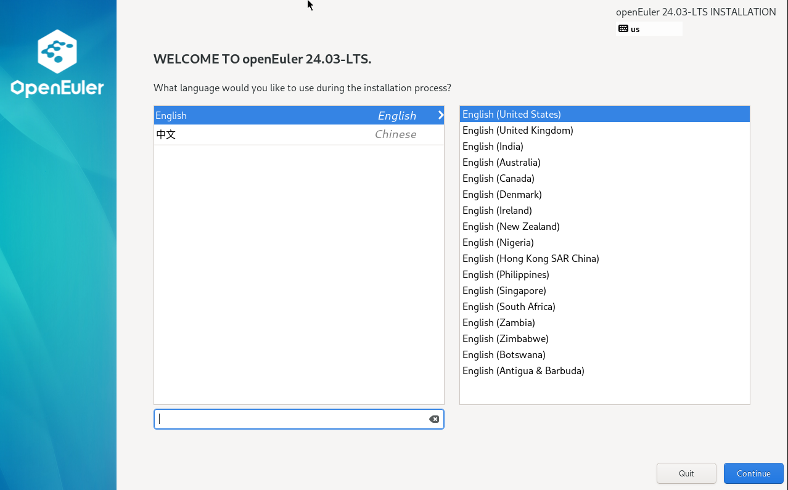

开启网络，使用DHCP

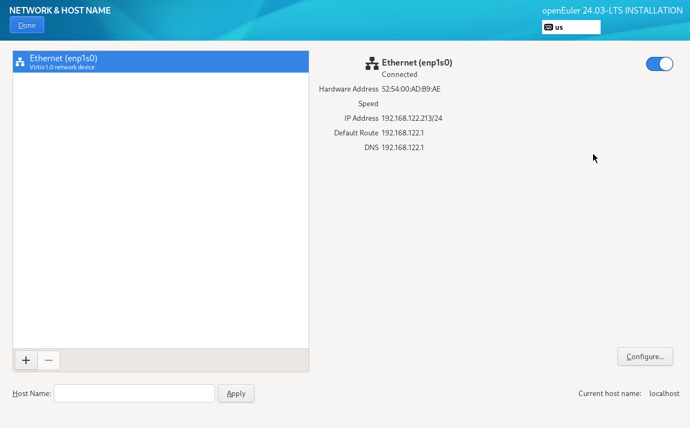

创建Standard Partition模式分区，如下图所示

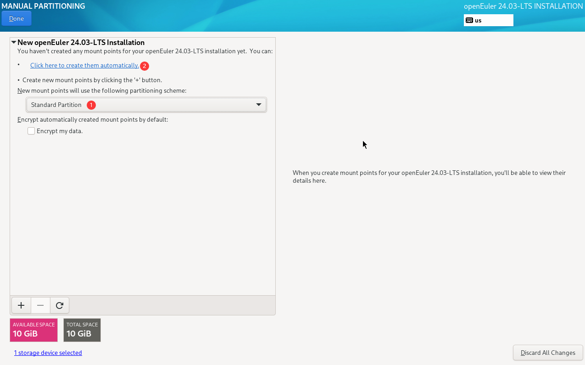

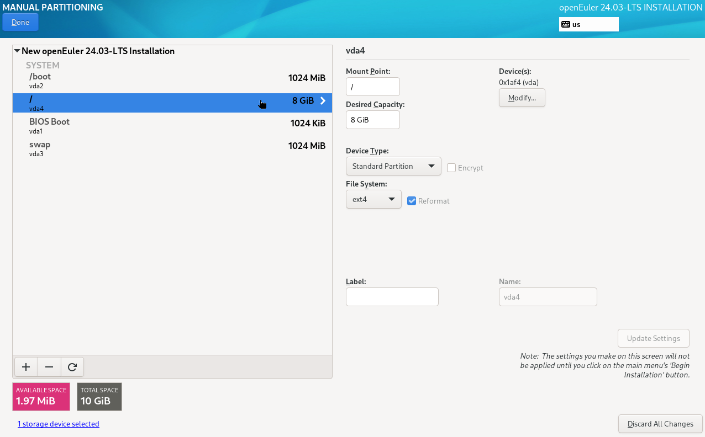

设置root用户

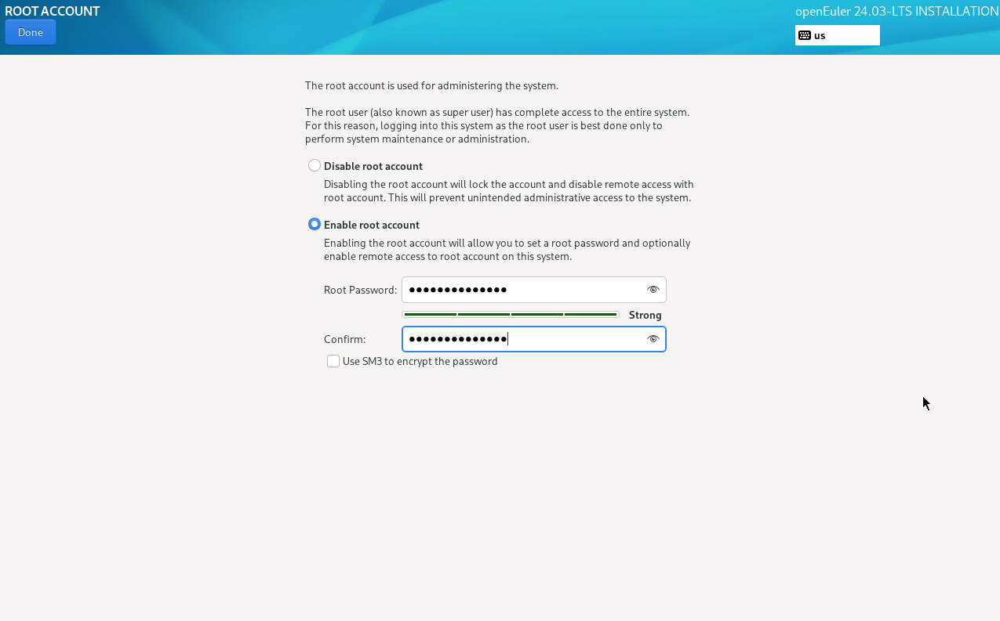

安装完毕后系统会重启，然后需要手动开机：`virsh start openEuler`，再次使用VNC连接进行相应的配置

#### **连接虚拟机**

通过SSH方式连接前面启动的虚拟机，以 root 用户身份登录到系统中，对系统进行定制（如安装自定义软件包，修改配置等）。定制完成后关闭虚拟机。
这里只根据通信缓存记录的mac 、IP地址手段做排查。在没缓存的情况下，下面的方法不适用，建议使用VNC连接然后查看IP地址，再进行SSH连接

通过SSH连接前面启动的虚拟机，使用root用户登录进行定制。

```bash
MAC=$(virsh dumpxml openEuler | grep -o "<mac address=.*/>" | awk -F "'" '{print $2}')
IPADDR=$(arp -ne | grep ${MAC} | awk '{print $1}')
echo ${IPADDR}
ssh root@${IPADDR}
```

*获取虚拟机的MAC地址，查找IP并SSH连接。*

#### **安装软件包**

**安装ACPI服务**

```
dnf -y install acpid
systemctl enable acpid
```

**安装cloud-init**

```
dnf -y install cloud-init
```

**安装cloud-utils-growpart允许分区调整**

```
dnf -y install cloud-utils-growpart
```

**配置控制台**

如果希望在仪表盘界面查看nova控制台的日志，需要做以下配置：

```
sed -i 's#GRUB_CMDLINE_LINUX=.*#GRUB_CMDLINE_LINUX="crashkernel=auto console=tty0 console=ttyS0,115200n8 net.ifnames=0"#g' /etc/default/grub
grub2-mkconfig -o /boot/grub2/grub.cfg
```

#### 优化操作系统

**修改root密码**：

```bash
echo Admin@123 | passwd root --stdin
```

**设置主机名**：

```bash
hostnamectl set-hostname openeuler.ateng.local
```

**设置hosts文件**：

```bash
cat > /etc/hosts <<EOF
127.0.0.1   localhost localhost.localdomain localhost4 localhost4.localdomain4
::1         localhost localhost.localdomain localhost6 localhost6.localdomain6
127.0.0.1 openeuler.ateng.local
EOF
```

**配置SSH**：

配置免秘钥

```
ssh-keygen -t rsa -P "" -f ~/.ssh/id_rsa -C "2385569970@qq.com"
cat ~/.ssh/id_rsa.pub > ~/.ssh/authorized_keys
```

*配置SSH以允许密码登录并重启服务。*

```bash
sed -i \
    -e "s/PasswordAuthentication.*/PasswordAuthentication yes/g" \
    -e 's/#UseDNS no/UseDNS no/g' \
    -e 's/GSSAPIAuthentication yes/GSSAPIAuthentication no/g' \
    -e 's/#PermitRootLogin prohibit-password/PermitRootLogin yes/g' \
    /etc/ssh/sshd_config
sed -i 's/#   StrictHostKeyChecking ask/   StrictHostKeyChecking no/g' /etc/ssh/ssh_config
```

**更改时区和时间**：

```bash
timedatectl set-timezone Asia/Shanghai
clock -w
timedatectl set-local-rtc 1
sed -i "/^pool/d" /etc/chrony.conf
sed -i "3i pool ntp.aliyun.com iburst" /etc/chrony.conf
systemctl restart chronyd
chronyc sources
```

*设置时区为上海，并同步时间。*

**禁用 SELinux 和 关闭防火墙**：

```bash
sed -i "s/SELINUX=.*/SELINUX=disabled/g" /etc/selinux/config
setenforce 0
systemctl stop firewalld
systemctl disable firewalld
```

*禁用SELinux以避免限制操作。*

**优化 cloud-init**

更新配置文件

```
cat > /etc/cloud/cloud.cfg <<"EOF"
## Author: KongYu
## Mail: 2385569970@qq.com
## Data: 2024-10-06
## Description:
## https://cloudinit.readthedocs.io/en/latest/topics/examples.html
## https://cloudinit.readthedocs.io/en/latest/topics/modules.html?highlight=disable_root
## https://cloudinit.readthedocs.io/en/latest/topics/network-config-format-v1.html

## 向系统添加组
groups:
  - ateng

## 向系统添加用户，添加组后再添加用户
users:
  - name: kongyu
    expiredate: 2099-12-31
    groups: ateng
    sudo: ALL=(ALL) NOPASSWD:ALL
    homedir: /home/kongyu
    lock_passwd: false

## 不禁用root登录
disable_root: false

## 开启ssh密码验证功能
ssh_pwauth: true
## 设置需要修改的默认密码
chpasswd:
  expire: false
  list:
    - kongyu:Admin@123

## 要设置的完全限定域名
fqdn: ateng.local
## 要设置的主机名
hostname: openeuler.ateng.local
## 如果设置了fqdn，则使用fqdn。如果为false，则使用主机名
prefer_fqdn_over_hostname: true
## 当hostname为true时不更新系统主机名。如果为true，则主机名不会更改
preserve_hostname: true
## 是否管理系统的/etc/hosts
manage_etc_hosts: false

## 自动配置网卡文件
network:
  version: 1
  config:
  - type: physical
    name: eth0
    subnets:
      - type: dhcp

mount_default_fields: [~, ~, 'auto', 'defaults,nofail', '0', '2']
resize_rootfs_tmp: /dev

cloud_init_modules:
  - migrator
  - seed_random
  - bootcmd
  - write_files
  - growpart
  - resizefs
  - disk_setup
  - mounts
  - ca_certs
  - rsyslog
  - users_groups
  - ssh

cloud_config_modules:
  - ssh_import_id
  - keyboard
  - locale
  - set_passwords
  - spacewalk
  - yum_add_repo
  - ntp
  - timezone
  - disable_ec2_metadata
  - runcmd

cloud_final_modules:
  - package_update_upgrade_install
  - write_files_deferred
  - puppet
  - chef
  - ansible
  - mcollective
  - salt_minion
  - reset_rmc
  - rightscale_userdata
  - scripts_vendor
  - scripts_per_once
  - scripts_per_boot
  - scripts_per_instance
  - scripts_user
  - ssh_authkey_fingerprints
  - keys_to_console
  - install_hotplug
  - phone_home
  - final_message
  - power_state_change

system_info:
  distro: openeuler
  default_user:
    name: openeuler
    lock_passwd: True
    gecos: openeuler Cloud User
    groups: [wheel, adm, systemd-journal]
    shell: /bin/bash
  paths:
    cloud_dir: /var/lib/cloud/
    templates_dir: /etc/cloud/templates/
  ssh_svcname: sshd
EOF
```

初始化配置

```
cloud-init init --local
```

**关闭虚拟机**：

```bash
poweroff
```

*完成定制后关闭虚拟机。*

#### 优化镜像

**工具自动清除虚拟机信息**：

使用 `virt-sysprep` 命令清除镜像中的唯一性信息（如SSH密钥、网卡MAC地址等）。

```bash
virt-sysprep -d openEuler
```

*运行此命令以准备干净的镜像。*

**镜像大小优化**：

**消除镜像空洞**：

```bash
mkdir -p /data/tmp
virt-sparsify --tmp /data/tmp ./openEuler.qcow2 ./openeuler-24.03-x86_64-01
```

*通过消除空洞来减小镜像大小。*

**二次压缩镜像**：

```bash
qemu-img convert -c -f qcow2 -O qcow2 -p ./openeuler-24.03-x86_64-01 ./openeuler-24.03-x86_64-01.qcow2
```

*进一步压缩镜像以节省空间。*

#### **删除虚拟机**

```bash
virsh shutdown openEuler
virsh destroy openEuler
virsh undefine openEuler
```

*如果不再需要虚拟机，可以使用这些命令删除它。*


### Windows Server 2022 镜像

#### 启动vm

**下载ISO镜像和创建qcow2镜像**：

镜像下载地址：https://www.xitongku.com/

```bash
mkdir -p /kvm
chown qemu:qemu /kvm
cd /kvm
qemu-img create -f qcow2 win2k22.qcow2 50G
```

**下载virtio**

```shell
curl -L -O https://fedorapeople.org/groups/virt/virtio-win/direct-downloads/archive-virtio/virtio-win-0.1.262-2/virtio-win.iso
```

**启动虚拟机**：

```bash
virt-install --connect qemu:///system \
    --name win2k22 --ram 2048 --vcpus 2 \
    --network bridge=br0,model=virtio \
    --disk path=./win2k22.qcow2,format=qcow2,device=disk,bus=virtio \
    --cdrom=./zh-cn_windows_server_2022_updated_june_2024_x64_dvd_8c5a802d.iso \
    --disk path=./virtio-win.iso,device=cdrom \
    --graphics vnc,listen=0.0.0.0,password=12345678,port=5904 \
    --noautoconsole --autostart --accelerate \
    --os-type windows --os-variant win2k22
```

*启动虚拟机并使用之前下载的镜像。*

#### **安装操作系统**

默认情况下，使用VirtIO驱动，Windows安装程序不检测磁盘。根据提示选择安装目标，加载VirtIO SCSI驱动程序

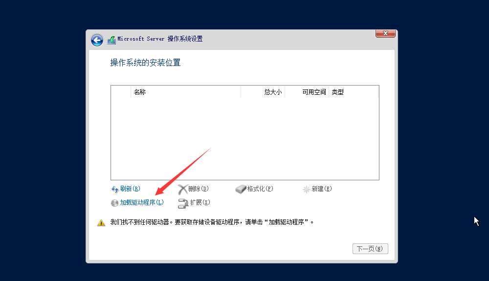

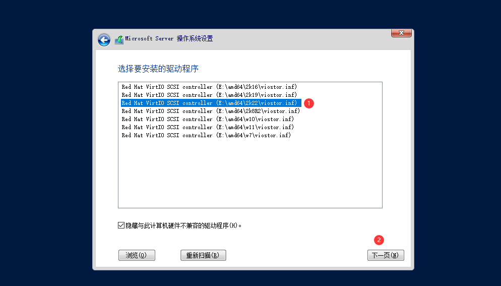

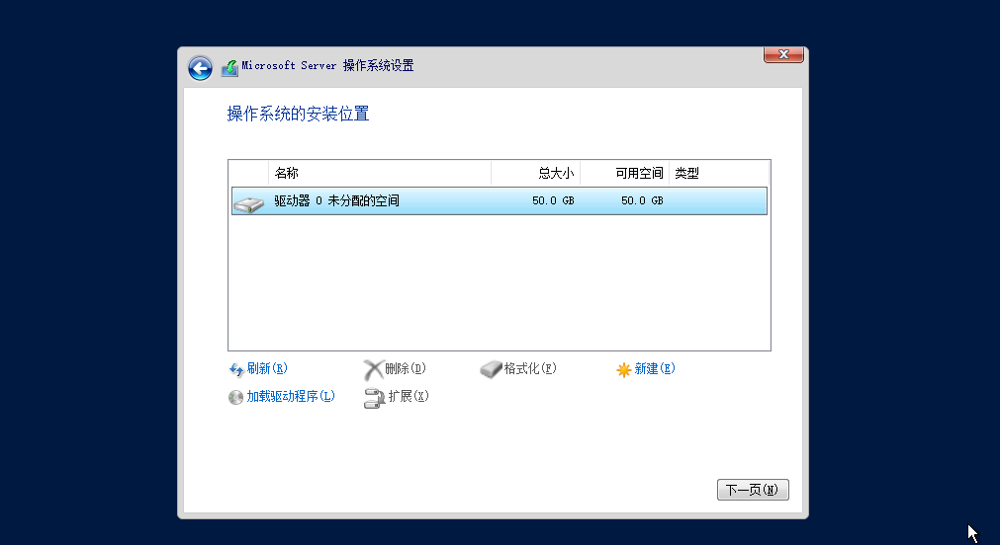

安装完毕后系统会重启，然后需要手动开机：`virsh start win2k22`，再次使用VNC连接进行相应的配置


#### **安装驱动**

相关命令可以执行参考以下

```
mount virtio-win.iso /mnt
find /mnt/ -name *.inf | egrep 2k22/amd64 | xargs -n1 -I {} ls {} | sed -e "s#/mnt#E:#" | tr "/" "\\" | sed "s#^#pnputil -i -a #"
```

**安装网络驱动**

先安装网络驱动，然后打开远程连接，使用rdp远程mstsc连接win2k22进行复制粘贴命令

```
pnputil -i -a E:\NetKVM\2k22\amd64\netkvm.inf
```

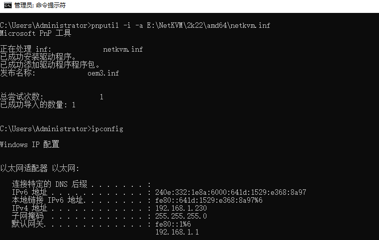

**开启远程访问**

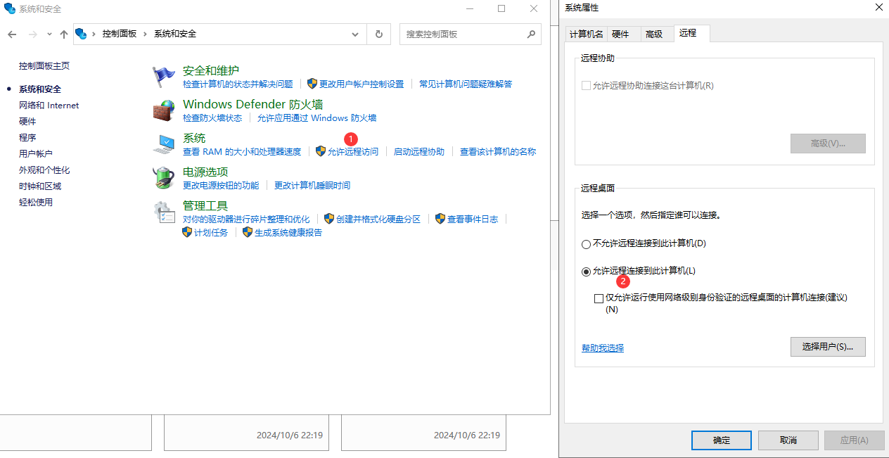

**安装驱动**

管理员身份运行cmd，使用pnputil命令行安装驱动

```
pnputil -i -a E:\Balloon\2k22\amd64\balloon.inf
pnputil -i -a E:\NetKVM\2k22\amd64\netkvm.inf
pnputil -i -a E:\fwcfg\2k22\amd64\fwcfg.inf
pnputil -i -a E:\pvpanic\2k22\amd64\pvpanic.inf
pnputil -i -a E:\qemufwcfg\2k22\amd64\qemufwcfg.inf
pnputil -i -a E:\qemupciserial\2k22\amd64\qemupciserial.inf
pnputil -i -a E:\smbus\2k22\amd64\smbus.inf
pnputil -i -a E:\sriov\2k22\amd64\vioprot.inf
pnputil -i -a E:\viofs\2k22\amd64\viofs.inf
pnputil -i -a E:\viogpudo\2k22\amd64\viogpudo.inf
pnputil -i -a E:\vioinput\2k22\amd64\vioinput.inf
pnputil -i -a E:\viorng\2k22\amd64\viorng.inf
pnputil -i -a E:\vioscsi\2k22\amd64\vioscsi.inf
pnputil -i -a E:\vioserial\2k22\amd64\vioser.inf
pnputil -i -a E:\viostor\2k22\amd64\viostor.inf
```

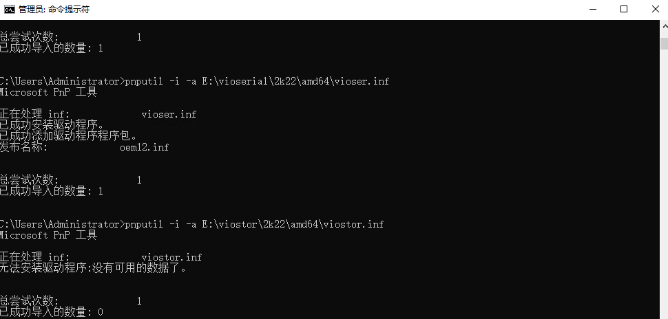

#### 安装Cloudbase-Init

```
## 使用管理员身份运行cmd
powershell
## 允许系统安装可执行脚本
Set-ExecutionPolicy Unrestricted
Invoke-WebRequest -UseBasicParsing https://cloudbase.it/downloads/CloudbaseInitSetup_Stable_x64.msi -OutFile cloudbaseinit.msi
.\cloudbaseinit.msi
## 执行完成之后，会弹窗。选择对应的用户名，默认为Admin(可以自定义用户名）
```

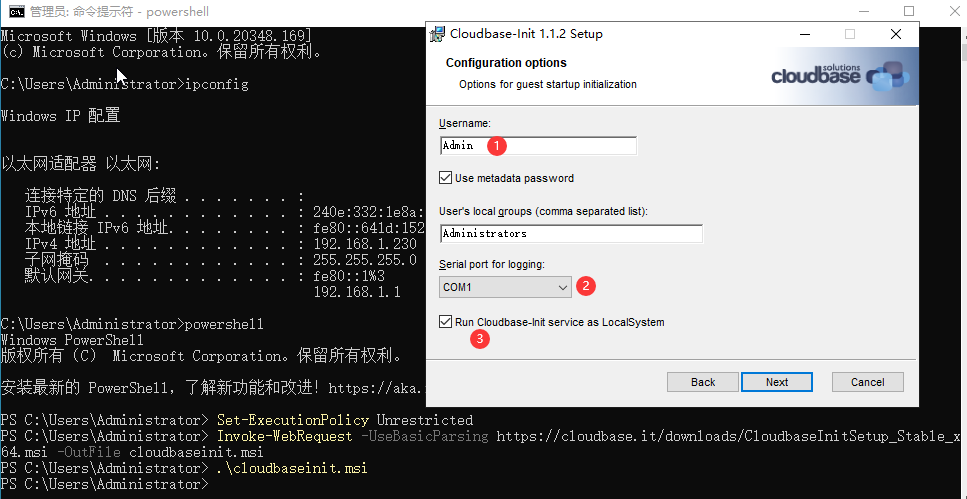

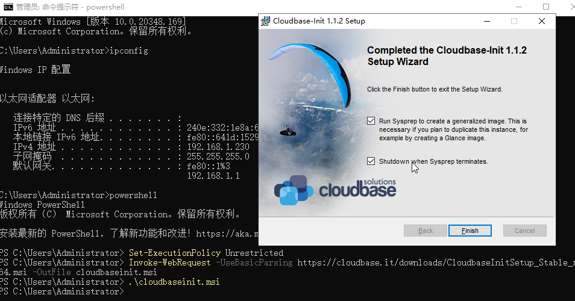

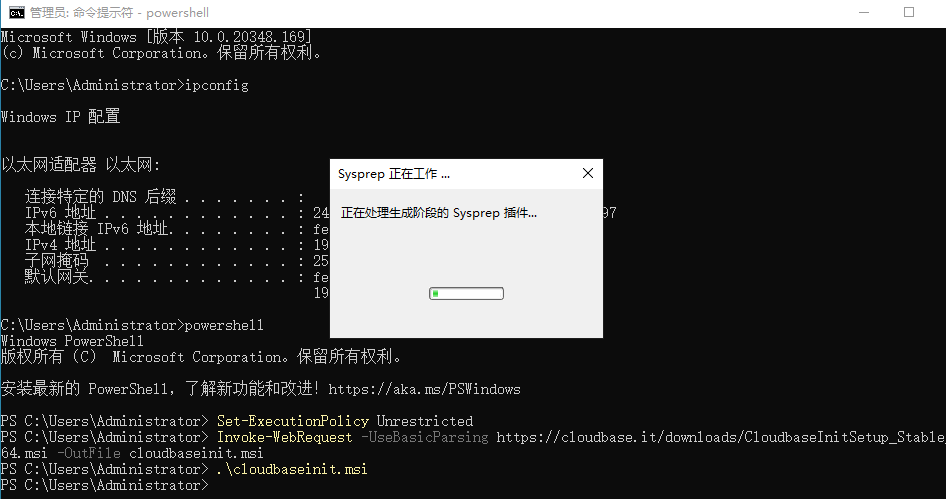


等待该虚拟机停机之后，win2k22.qcow2就是制作好的镜像


#### 优化镜像

**镜像大小优化**：

**消除镜像空洞**：

```bash
mkdir -p /data/tmp
virt-sparsify --tmp /data/tmp ./win2k22.qcow2 ./windows_server_2022_x64-02
```

*通过消除空洞来减小镜像大小。*

**二次压缩镜像**：

```bash
qemu-img convert -c -f qcow2 -O qcow2 -p ./windows_server_2022_x64-02 ./windows_server_2022_x64-02.qcow2
```

*进一步压缩镜像以节省空间。*

#### **删除虚拟机**

```bash
virsh shutdown win2k22
virsh destroy win2k22
virsh undefine win2k22
```

*如果不再需要虚拟机，可以使用这些命令删除它。*


## 启动虚拟机

### Windows Server 2022

**查看镜像信息**

```
qemu-img info windows_server_2022_x64-02.qcow2
```

可以看到`virtual size: 50 GiB (53687091200 bytes)`，镜像的虚拟大小是50GB，也就是操作系统的根目录大小。`disk size: 5.82 GiB`为实际占用空间

**扩展 QCOW2 镜像的大小**（可选）

```
qemu-img resize windows_server_2022_x64-02.qcow2 100G
```

这样会把镜像的容量改成 100G，但是请注意：

1. 这个命令只是扩展了虚拟硬盘的大小，实际系统中的分区大小不会自动变化。

**启动虚拟机**

```
virt-install --connect qemu:///system --import \
    --name win2k22-1 --ram 2048 --vcpus 2 \
    --network bridge=br0,model=virtio \
    --disk path=./windows_server_2022_x64-02.qcow2,format=qcow2,device=disk,bus=virtio \
    --graphics vnc,listen=0.0.0.0,password=12345678,port=5912 \
    --noautoconsole --autostart --accelerate \
    --os-type windows --os-variant win2k22
```

- 桥接模式：--network bridge=br0,model=virtio
- NAT模式：--network network=default,model=virtio

**查看VNC端口**

会看到`:12`返回内容，也就是VNC端口是 5012

```
virsh vncdisplay win2k22-1
```

**关闭虚拟机**

```
virsh shutdown win2k22-1
virsh undefine win2k22-1
```


### CentOS 7

**查看镜像信息**

```
qemu-img info centos-7.9-2009-x86_64-01.qcow2
```

可以看到`virtual size: 5 GiB (5368709120 bytes)`，镜像的虚拟大小是5GB，也就是操作系统的根目录大小。`disk size: 629 MiB`为实际占用空间

**扩展 QCOW2 镜像的大小**（可选）

```
qemu-img resize centos-7.9-2009-x86_64-01.qcow2 100G
```

这样会把镜像的容量改成 100G，但是请注意：

1. 这个命令只是扩展了虚拟硬盘的大小，实际系统中的分区大小不会自动变化。
2. 如果你想在虚拟机里使用扩展后的空间，还需要登录虚拟机并使用工具（例如 `fdisk` 或 `growpart`）扩展相应的分区，之后再使用 `resize2fs` 或 `xfs_growfs` 来调整文件系统的大小。

**启动虚拟机**

```
virt-install --connect qemu:///system --import \
  --name centos-2 --ram 2048 --vcpus 2 \
  --network network=default,model=virtio \
  --disk path=./centos-7.9-2009-x86_64-01.qcow2,format=qcow2,device=disk,bus=virtio \
  --graphics vnc,listen=0.0.0.0,password=12345678,port=5912 \
  --noautoconsole --autostart --accelerate \
  --os-type=linux --os-variant=centos7.0
```

- 桥接模式：--network bridge=br0,model=virtio
- NAT模式：--network network=default,model=virtio

**查看VNC端口**

会看到`:12`返回内容，也就是VNC端口是 5012

```
virsh vncdisplay centos-2
```

**关闭虚拟机**

```
virsh shutdown centos-2
virsh undefine centos-2
```


### OpenEuler 24

**查看镜像信息**

```
qemu-img info openeuler-24.03-x86_64-01.qcow2
```

可以看到`virtual size: 10 GiB (10737418240 bytes)`，镜像的虚拟大小是10GB，也就是操作系统的根目录大小。`disk size: 980 MiB`为实际占用空间

**扩展 QCOW2 镜像的大小**（可选）

```
qemu-img resize openeuler-24.03-x86_64-01.qcow2 100G
```

这样会把镜像的容量改成 100G，但是请注意：

1. 这个命令只是扩展了虚拟硬盘的大小，实际系统中的分区大小不会自动变化。
2. 如果你想在虚拟机里使用扩展后的空间，还需要登录虚拟机并使用工具（例如 `fdisk` 或 `growpart`）扩展相应的分区，之后再使用 `resize2fs` 或 `xfs_growfs` 来调整文件系统的大小。

**启动虚拟机**

```
virt-install --connect qemu:///system --import \
  --name openEuler-2 --ram 2048 --vcpus 2 \
  --network network=default,model=virtio \
  --disk path=./openeuler-24.03-x86_64-01.qcow2,format=qcow2,device=disk,bus=virtio \
  --graphics vnc,listen=0.0.0.0,password=12345678,port=5912 \
  --noautoconsole --autostart --accelerate \
  --os-type=linux --os-variant=linux2022
```

- 桥接模式：--network bridge=br0,model=virtio
- NAT模式：--network network=default,model=virtio

**查看VNC端口**

会看到`:12`返回内容，也就是VNC端口是 5012

```
virsh vncdisplay openEuler-2
```

**关闭虚拟机**

```
virsh shutdown openEuler-2
virsh undefine openEuler-2
```

