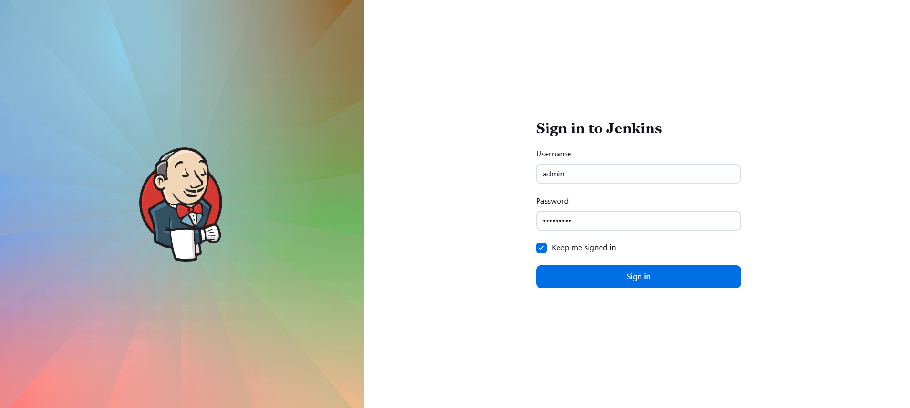

# Jenkins

Jenkins 是一个开源的自动化服务器，广泛用于实现持续集成（CI）和持续交付（CD）。它支持通过插件扩展，能够自动化构建、测试、部署等软件开发流程。Jenkins 提供了图形化的用户界面、分布式构建功能、丰富的插件生态以及强大的集成能力，帮助开发团队提高开发效率和交付速度。

- [官网链接](https://www.jenkins.io/)

- [Docker安装Jenkins文档](/work/docker/service/jenkins/)
- [Kubernetes安装Jenkins文档](/work/kubernetes/service/jenkins/v2.492.2/baseic/)


## 基础配置

### 登录Web

进入Jenkins Web，输入账号密码登录



### 安装插件

**进入安装插件页面**

点击 `Manage Jenkins` → `Plugins` → `Available plugins` 安装插件

**搜索插件**

- 中文插件

 Localization: Chinese (Simplified)` 

- SSH 插件

SSH Pipeline Steps、Publish Over SSH

**下载并安装**

搜索完下载的插件后开始下载并安装，安装完后重启Jenkins


### 环境变量

**内置环境变量**

通过 http://192.168.1.12:20022/env-vars.html/ 可以查看Jenkins支持的环境变量

**自定义环境变量**

点击 `系统管理` → `系统配置` → `全局属性` → `环境变量`，新增自定义的环境变量


**使用环境变量**

后续可以使用这些环境变量，例如

```
echo "Job Name: $JOB_NAME"
echo "Build Number: $BUILD_NUMBER"
echo "Workspace: $WORKSPACE"
echo "Author: $Author"
```


## SSH Server

在开始直接需要按照插件，见 `基础配置的安装插件` 章节的 `SSH 插件`

### 添加SSH服务器

**进入配置**

点击 `系统管理` → `系统配置` → `SSH Servers` ，找到 SSH Servers，新增SSH服务器

**基础配置**


**高级配置**

在高级配置中使用密码或者秘钥、设置SSH端口


**测试连接**

配置完毕后点击测试结果为Success即连接成功


**保存配置**

最后点击 `Save` 保存配置


### SSH服务器配置

**查看秘钥**

```
cat .ssh/id_rsa
```

**创建目录**

```
mkdir -p /data/service/work/jenkins
```


### 创建任务

**新建任务**

任务名称不能中文


**配置构建步骤**

选择 Send files or execute commands over SSH


选择SSH服务器和开启详细日志


在 **"Exec Command"** 中填入要执行的 Linux 命令，如

```bash
echo "Hello from Jenkins"
whoami
uname -a
env
```


最后保存

### 构建任务

点击 `立即构建` 开始运行任务


任务运行完后查看控制台输出


## CICD: Linux部署Springboot项目

请先参考 `SSH Server` 章节完成相关配置

在实际开发时，使用Springboot框架，代码提交的本地Gitlab，通过提交代码的方式触发Webhook，使Jenkins触发自动构建和部署。Jenkins连接远程Linux服务器，执行脚本。在脚本中从Gitlab中拉取代码，然后使用Maven打包Jar文件，最后使用Java命令启动Jar。

- [JDK安装文档](/work/service/openjdk/openjdk21/)
- [Maven安装文档](/work/service/maven/v3.9.9/)
- [Git安装文档](/work/service/git/v2.49.0/)
- [NVM 和 Node.js 安装文档](/work/service/nvm/v0.40.2/)


### 基础准备

这一步骤是用演示的数据，在实际情况下可以跳过该步骤

#### 下载代码

访问 https://start.spring.io/ 网站填写相关参数下载Springboot源码。也可以通过这里设置好的参数直接下载：[链接](https://start.spring.io/starter.zip?type=maven-project&language=java&bootVersion=3.4.4&baseDir=springboot-demo&groupId=local.ateng.demo&artifactId=springboot-demo&name=springboot-demo&description=Demo%20project%20for%20Spring%20Boot&packageName=local.ateng.demo.springboot-demo&packaging=jar&javaVersion=21&dependencies=web)

#### 提交Git仓库

**解压文件**

```
unzip springboot-demo.zip
cd springboot-demo/
```

**Git 全局设置**

```
git config --global user.name "阿腾"
git config --global user.email "2385569970@qq.com"
```

**推送现有文件夹**

```
git init --initial-branch=master
git remote add origin http://gitlab.lingo.local/kongyu/springboot-demo.git
git add .
git commit -m "Initial commit"
git push -u origin master
```

